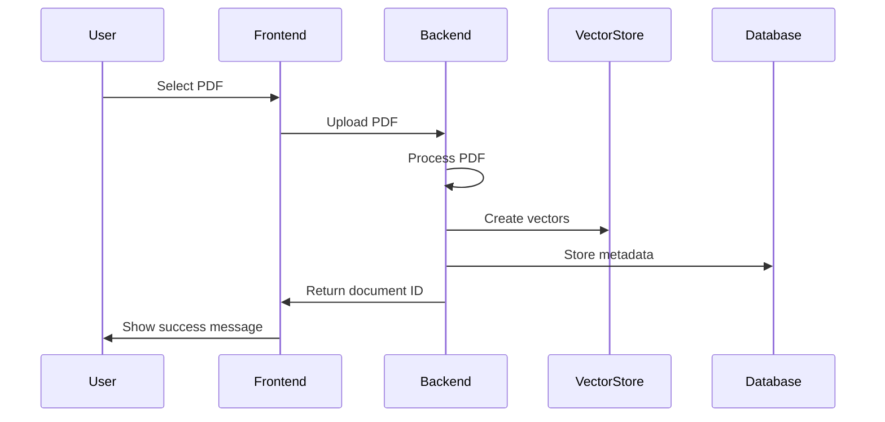
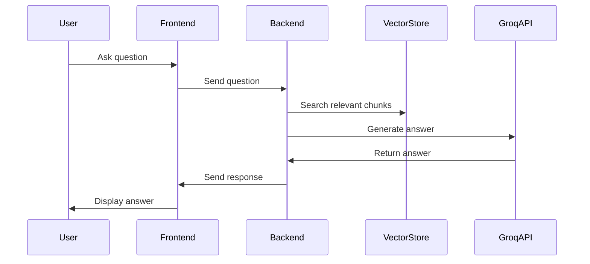

# PDF Analyzer - Code Architecture Overview

## Table of Contents
1. [Project Structure](#project-structure)
2. [Component Overview](#component-overview)
3. [Code Flow](#code-flow)
4. [Key Components](#key-components)
5. [Data Flow](#data-flow)
6. [State Management](#state-management)

## Project Structure

```
pdf_analyser/
├── backend/
│   ├── app/
│   │   ├── main.py           # FastAPI application entry point
│   │   ├── models.py         # Database models
│   │   ├── db.py            # Database configuration
│   │   └── pdf_utils.py     # PDF processing utilities
│   ├── uploads/             # PDF storage
│   ├── vector_stores/       # TF-IDF vector stores
│   └── requirements.txt     # Python dependencies
└── frontend/
    ├── src/
    │   ├── components/      # React components
    │   ├── assets/         # Static assets
    │   ├── App.jsx        # Main application component
    │   └── main.jsx       # Application entry point
    └── package.json       # Node dependencies
```

## Component Overview

### Backend Components

1. **FastAPI Application (`main.py`)**
   ```python
   # Core responsibilities:
   - API endpoint definitions
   - Request handling
   - Response formatting
   - Error handling
   - CORS configuration
   ```

2. **Database Models (`models.py`)**
   ```python
   # Core responsibilities:
   - SQLAlchemy model definitions
   - Database schema
   - Data validation
   - Relationships between models
   ```

3. **PDF Utilities (`pdf_utils.py`)**
   ```python
   # Core responsibilities:
   - PDF text extraction
   - Text chunking
   - Vector store creation
   - Similarity search
   ```

4. **Database Configuration (`db.py`)**
   ```python
   # Core responsibilities:
   - Database connection management
   - Session handling
   - Connection pooling
   ```

### Frontend Components

1. **Main Application (`App.jsx`)**
   ```javascript
   // Core responsibilities:
   - Application state management
   - Component composition
   - API integration
   - Event handling
   ```

2. **Upload Component**
   ```javascript
   // Core responsibilities:
   - File upload handling
   - Upload progress tracking
   - Error handling
   - User feedback
   ```

3. **Chat Interface**
   ```javascript
   // Core responsibilities:
   - Message display
   - User input handling
   - Message history management
   - Real-time updates
   ```

4. **Toast Notifications**
   ```javascript
   // Core responsibilities:
   - System notifications
   - Error messages
   - Success messages
   - Auto-dismissal
   ```

## Code Flow

### PDF Upload Process


### Question Answering Process


## Key Components

### Backend Services

1. **PDF Processing Service**
   ```python
   class PDFService:
       def process_pdf(self, file_path: str) -> Dict:
           # Extract text
           # Split into chunks
           # Create vector store
           # Store in database
   ```

2. **Vector Store Service**
   ```python
   class VectorStoreService:
       def create_store(self, chunks: List[str]) -> str:
           # Create TF-IDF vectors
           # Save to disk
           # Return store path
   ```

3. **Question Answering Service**
   ```python
   class QAService:
       def get_answer(self, question: str, doc_id: int) -> str:
           # Get relevant chunks
           # Generate answer
           # Return response
   ```

### Frontend Services

1. **API Service**
   ```javascript
   class APIService {
       async uploadPDF(file: File): Promise<Response>
       async askQuestion(question: string, docId: string): Promise<Response>
       async getDocuments(): Promise<Response>
   }
   ```

2. **State Management**
   ```javascript
   const [state, setState] = useState({
       file: null,
       messages: [],
       documentId: null,
       isLoading: false
   });
   ```

## Data Flow

### State Updates
```javascript
// File Upload
setState(prev => ({
    ...prev,
    file: selectedFile,
    isLoading: true
}));

// Message Handling
setState(prev => ({
    ...prev,
    messages: [...prev.messages, newMessage]
}));
```

### API Calls
```javascript
// PDF Upload
const uploadPDF = async (file) => {
    const formData = new FormData();
    formData.append('file', file);
    return await axios.post('/upload-pdf', formData);
};

// Question Answering
const askQuestion = async (question, docId) => {
    return await axios.get('/ask-question', {
        params: { question, document_id: docId }
    });
};
```

## State Management

### Application State
```javascript
interface AppState {
    // File Management
    file: File | null;
    documentId: string | null;
    
    // Chat Management
    messages: Message[];
    inputMessage: string;
    
    // UI State
    isLoading: boolean;
    isResponding: boolean;
    toast: Toast | null;
}

interface Message {
    role: 'user' | 'assistant';
    content: string;
}

interface Toast {
    type: 'success' | 'error';
    message: string;
}
```

### State Updates
```javascript
// File Upload
const handleFileUpload = async (file) => {
    setState(prev => ({ ...prev, isLoading: true }));
    try {
        const response = await uploadPDF(file);
        setState(prev => ({
            ...prev,
            file,
            documentId: response.data.document_id,
            isLoading: false
        }));
    } catch (error) {
        setState(prev => ({
            ...prev,
            isLoading: false,
            toast: { type: 'error', message: 'Upload failed' }
        }));
    }
};
```

## Error Handling

### Backend Error Handling
```python
@app.exception_handler(HTTPException)
async def http_exception_handler(request, exc):
    return JSONResponse(
        status_code=exc.status_code,
        content={"message": exc.detail}
    )
```

### Frontend Error Handling
```javascript
const handleError = (error) => {
    setToast({
        type: 'error',
        message: error.response?.data?.message || 'An error occurred'
    });
};
```

## Performance Optimizations

### Backend
- PDF processing in chunks
- Vector store caching
- Database indexing
- Response compression

### Frontend
- Lazy loading
- Debounced input
- Optimized re-renders
- Asset optimization 