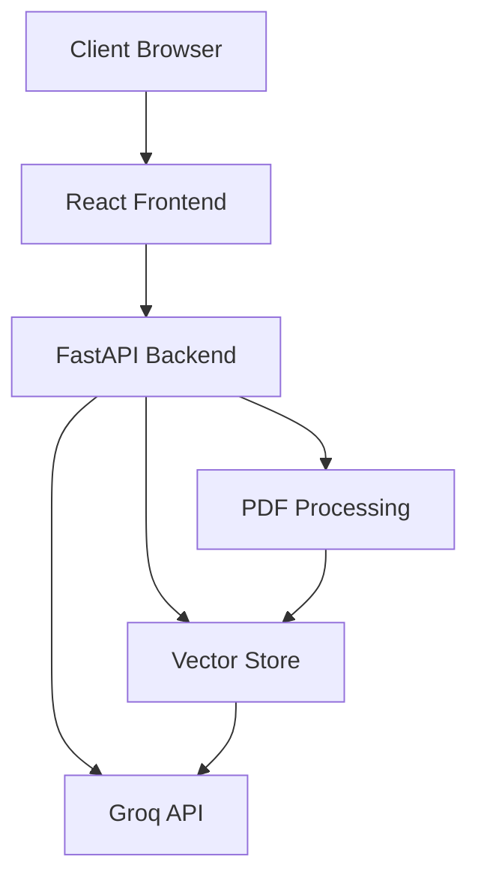
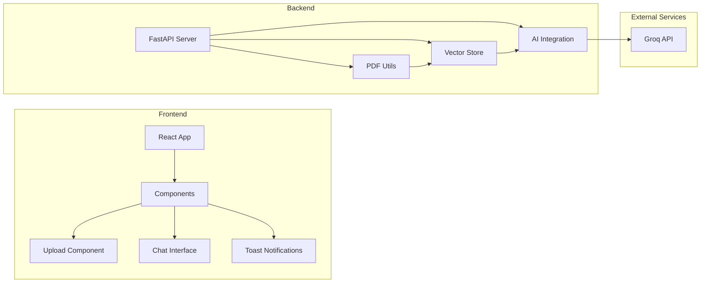

# PDF Analyzer - Design Document

## Table of Contents
1. [High Level Design (HLD)](#high-level-design-hld)
   - [System Architecture](#system-architecture)
   - [Component Diagram](#component-diagram)
   - [Data Flow](#data-flow)
   - [Technology Stack](#technology-stack)
2. [Low Level Design (LLD)](#low-level-design-lld)
   - [Backend Design](#backend-design)
   - [Frontend Design](#frontend-design)
   - [Database Design](#database-design)
   - [API Design](#api-design)
3. [Security Design](#security-design)
4. [Performance Considerations](#performance-considerations)

## High Level Design (HLD)

### System Architecture



### Component Diagram



### Data Flow

1. **PDF Upload Flow**:
   ```
   Client -> Frontend -> Backend -> PDF Processing -> Vector Store -> Database
   ```

2. **Question Answering Flow**:
   ```
   Client -> Frontend -> Backend -> Vector Store -> AI Processing -> Response
   ```

### Technology Stack

1. **Frontend**:
   - React (UI Framework)
   - Vite (Build Tool)
   - Axios (HTTP Client)
   - React Icons
   - React Markdown

2. **Backend**:
   - FastAPI (Web Framework)
   - SQLAlchemy (ORM)
   - LangChain (PDF Processing)
   - scikit-learn (TF-IDF)
   - Groq API (AI)

3. **Database**:
   - SQLite (Development)
   - Vector Store (TF-IDF)

## Low Level Design (LLD)

### Backend Design

#### PDF Processing Module
```python
class PDFProcessor:
    def extract_text(pdf_path: str) -> str
    def split_text(text: str) -> List[str]
    def create_vector_store(chunks: List[str]) -> Dict
    def search_vector_store(query: str) -> List[str]
```

#### Vector Store Module
```python
class VectorStore:
    def __init__(self):
        self.vectorizer = TfidfVectorizer()
        self.chunks = []
        self.tfidf_matrix = None

    def add_documents(chunks: List[str])
    def search(query: str, top_k: int) -> List[str]
```

#### API Endpoints
```python
@app.post("/upload-pdf")
async def upload_pdf(file: UploadFile)

@app.get("/ask-question")
async def ask_question(question: str, document_id: int)

@app.get("/documents")
async def get_documents()
```

### Frontend Design

#### Component Structure
```
src/
├── components/
│   ├── UploadButton/
│   │   ├── index.jsx
│   │   └── styles.css
│   ├── ChatInterface/
│   │   ├── index.jsx
│   │   └── styles.css
│   └── Toast/
│       ├── index.jsx
│       └── styles.css
└── App.jsx
```

#### State Management
```javascript
// Main Application State
{
  file: File | null,
  messages: Array<Message>,
  documentId: string | null,
  isLoading: boolean,
  isResponding: boolean
}

// Message Structure
interface Message {
  role: 'user' | 'assistant',
  content: string
}
```

### Database Design

#### PDFDocument Table
```sql
CREATE TABLE pdf_documents (
    id INTEGER PRIMARY KEY,
    filename TEXT NOT NULL,
    file_path TEXT NOT NULL,
    vector_store_path TEXT NOT NULL,
    created_at TIMESTAMP DEFAULT CURRENT_TIMESTAMP
);
```

### API Design

#### Upload PDF
```http
POST /upload-pdf
Content-Type: multipart/form-data

Response:
{
    "document_id": string,
    "filename": string,
    "message": string
}
```

#### Ask Question
```http
GET /ask-question
Parameters:
    question: string
    document_id: integer

Response:
{
    "answer": string,
    "context": string
}
```

## Security Design

### Authentication & Authorization
- API key based authentication for Groq API
- Environment variable based configuration
- CORS configuration for frontend access

### Data Security
- File upload validation
- SQL injection prevention
- XSS protection
- Input sanitization

### File Security
- File type validation
- File size limits
- Secure file storage

## Performance Considerations

### Frontend Optimization
- Lazy loading of components
- Efficient state management
- Responsive design optimization
- Asset optimization

### Backend Optimization
- PDF processing optimization
- Vector store caching
- Database indexing
- API response caching

### Scalability
- Horizontal scaling capability
- Load balancing readiness
- Database scaling strategy
- Vector store optimization

## Future Enhancements

### Technical Improvements
1. Implement FAISS for better vector search
2. Add Redis caching layer
3. Implement WebSocket for real-time updates
4. Add rate limiting

### Feature Enhancements
1. User authentication system
2. Document sharing capabilities
3. Multiple file format support
4. Advanced search capabilities

### Infrastructure Improvements
1. Containerization with Docker
2. CI/CD pipeline setup
3. Monitoring and logging
4. Backup and recovery systems 