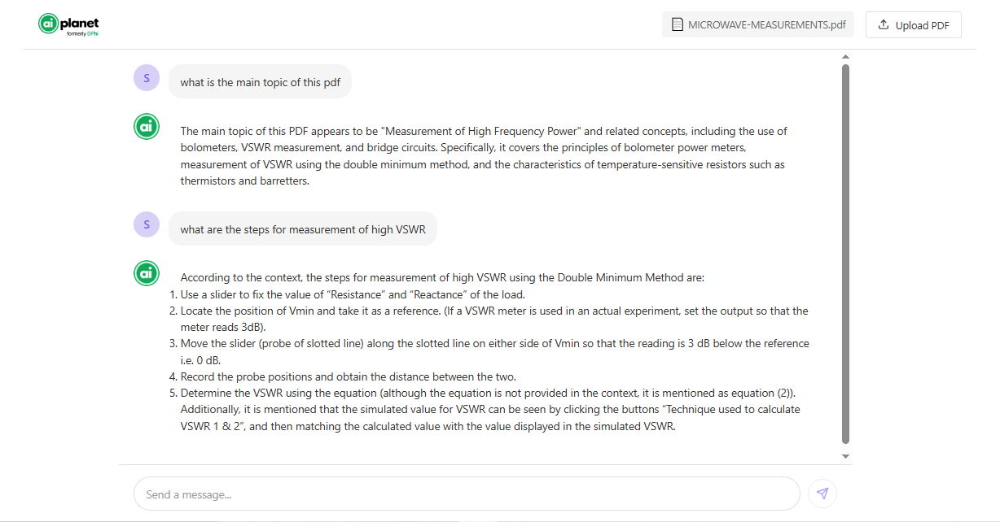
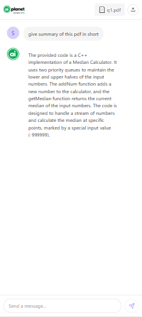

# PDF Analyzer Application

An interactive PDF analysis application that allows users to upload PDF documents and ask questions about their content using AI. The application uses FastAPI for the backend, React for the frontend, and Groq's API for AI-powered question answering.

## Screenshots

### Desktop View


### Mobile View


## Features

- PDF document upload and processing
- AI-powered question answering about PDF content
- Real-time chat-like interface
- Toast notifications for system messages
- Document management system
- Responsive user interface
- Mobile-first design with adaptive layout
- TF-IDF based document similarity search

## Project Structure
```
pdf_analyser/
├── backend/
│   ├── app/
│   │   ├── main.py           # FastAPI application
│   │   ├── models.py         # Database models
│   │   ├── db.py            # Database configuration
│   │   └── pdf_utils.py     # PDF processing utilities
│   ├── uploads/             # Directory for uploaded PDFs
│   ├── vector_stores/       # Directory for TF-IDF vector stores
│   └── requirements.txt     # Backend dependencies
├── frontend/
│   ├── src/
│   │   ├── components/      # React components
│   │   ├── styles/         # CSS styles
│   │   ├── App.jsx        # Main application component
│   │   └── main.jsx       # Application entry point
│   ├── package.json       # Frontend dependencies
│   └── vite.config.js     # Vite configuration
└── README.md              # Documentation
```

## Quick Start

### Backend Setup

1. Create a Python virtual environment:
```bash
cd backend
python -m venv venv
source venv/bin/activate  # On Windows: venv\Scripts\activate
```

2. Install backend dependencies:
```bash
pip install -r requirements.txt
```

3. Create a `.env` file in the backend directory:
```
GROQ_API_KEY=your_groq_api_key_here
```

4. Start the FastAPI server:
```bash
uvicorn app.main:app --reload --port 8000
```

### Frontend Setup

1. Install frontend dependencies:
```bash
cd frontend
npm install
```

2. Start the development server:
```bash
npm run dev
```

The application will be available at `http://localhost:5173`

## API Documentation

### Backend Endpoints

#### Upload PDF
- **POST** `/upload-pdf`
- **Request**: Multipart form data with PDF file
- **Response**: 
```json
{
    "document_id": "string",
    "filename": "string",
    "message": "string"
}
```

#### Ask Question
- **POST** `/ask-question`
- **Request Body**:
```json
{
    "question": "string",
    "document_id": "string"
}
```
- **Response**:
```json
{
    "answer": "string",
    "context": "string"
}
```

#### Get Documents
- **GET** `/documents`
- **Response**: List of uploaded documents with their IDs

## Architecture Overview

### Backend
- **FastAPI**: Provides the REST API endpoints
- **SQLAlchemy**: Database ORM for document management
- **LangChain**: Framework for PDF processing and text chunking
- **Groq API**: AI model for question answering
- **TF-IDF Vectorization**: 
  - Uses scikit-learn's TfidfVectorizer for text vectorization
  - Implements cosine similarity for document chunk matching
  - Stores vectorized chunks for efficient retrieval
  - Supports configurable chunk size and overlap

### Frontend
- **React**: UI framework
- **Vite**: Build tool and development server
- **Axios**: HTTP client for API communication
- **React Icons**: Icon library
- **React Markdown**: Markdown rendering for AI responses

## Development

### Backend Development
- The backend uses SQLite database for development
- PDF files are stored in the `uploads` directory
- TF-IDF vector stores are saved in `vector_stores` directory
- Text is split into chunks using LangChain's RecursiveCharacterTextSplitter
- Document similarity is calculated using cosine similarity
- Vector stores are persisted using Python's pickle format

### Frontend Development
- Components are organized in the `src/components` directory
- Styles are maintained in `src/styles`
- The application uses custom CSS for styling
- Responsive design with mobile-first approach
- Adaptive layout for different screen sizes

## Production Deployment

1. Build the frontend:
```bash
cd frontend
npm run build
```

2. Configure the backend for production:
- Set appropriate environment variables
- Use a production-grade database
- Configure CORS settings
- Set up proper security measures

## Security Considerations

- API keys are stored in environment variables
- File uploads are validated and sanitized
- CORS is configured for security
- Database queries are protected against SQL injection
- File size limits are enforced for uploads

## Future Improvements

- Add user authentication
- Implement document sharing
- Add support for more file formats
- Enhance error handling and recovery
- Implement caching for better performance
- Optimize TF-IDF vector store for larger documents
- Add dark mode support
- Implement file preview functionality
- Add support for multiple languages
- Consider implementing more advanced vector stores (e.g., FAISS, HNSW)
``` 